# TP5 - Medina Santinon, Pardiñas

## Informática Médica - 16.22

**TP V:** 2Q 2024

### Profesores:
- Lazarino, Carlos
- Spessotti, Ingrid Celia
- Berrino, Eugenia Camila

### Alumnas:
- Pardiñas, Victoria - 60015
- Medina Santinon, Valentina - 61462

**Grupo N°12**

**Fecha de entrega:** 23/10/2024

---

## PARTE I: Bases de Datos

Durante el desarrollo de este trabajo se utilizó la base de datos provista por la cátedra, MedicalCenterDataBase, que consta de 5 entidades determinadas y explicadas en conjunto con sus relaciones en el ítem 2 de esta sección.

### 1. ¿Qué tipo de base de datos es? Clasificarla según estructura y función.

La base de datos contiene datos cualitativos estructurados. Estan divididos de manera tal que no hay datos polivalentes ni campos compuestos, salvo al tratarse de direcciones donde la especificación de Calle o Avenida esta dentro del nombre de la misma, por ejemplo, “Avenida Cordoba” donde Cordoba es el nombre propio, y avenida una especificación, por lo que es accesible toda la información. Las tablas poseen datos booleanos (solo en el caso de tratamientos), y nominales.

### 2. Armar el diagrama entidad-relación de la base de datos dada.

El siguiente diagrama se desarrolló en LucidChart donde se señalaron las Primary Keys (PK) de cada entidad en color rosa oscuro, y las Foreign Keys (FK) en color más claro, es importante destacar que las FK de una entidad, son además PK en otra. Las relaciones entre entidades se terminaron de la siguiente forma:
- Las recetas (1) prescriben medicamentos (N) con una relación 1 a muchos, que indica que una receta puede prescribir cantidad y frecuencia para al menos un medicamento acorde a la enfermedad del paciente
- Los medicos (N) escriben recetas (N) con una relación muchos a muchos, dado que un paciente puede tener distintos medicos (con distintas especialidades), y estos pueden generar recetas para diferentes afecciones.
- Las consultas (1) provocan recetas (N) de manera que cada consulta con sintomas puede ocasionar al menos una receta correspondiente a los sintomas o malestares detectados.
- Los pacientes (1) adquieren recetas (N). Cada paciente puede adquirir diversas recetas pero cada receta es especifica para ese paciente.
- Los pacientes (1) tienen consultas (N), donde sucede algo similar al caso anterior, pueden tener varias consultas, con el mismo medico o medicos de distintas especialidades.
- Las consultas (N) las realizan medicos (1) cada médico puede tener varias consultas, pero las mismas son especificas para cada profesional.

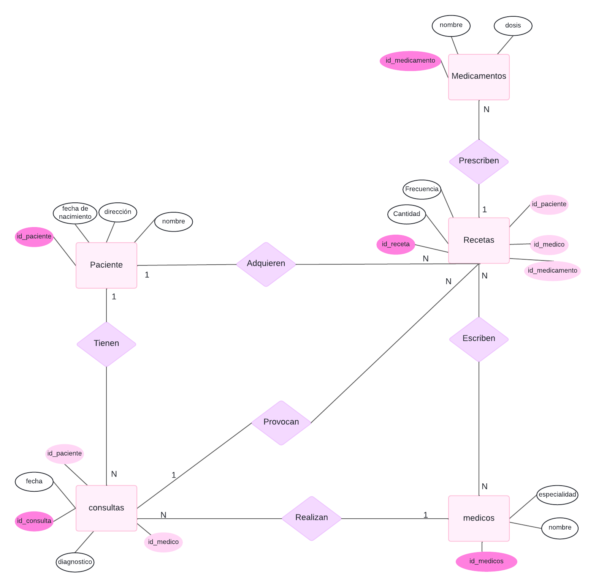


### 3. Armar el modelo relacional de la base de datos.


En la figura se representa el modelo relacional, con relaciones 1 a muchos (1-N) como:


Relaciones uno a muchos (1-N)
- Pacientes - Consultas: Un paciente puede tener muchas consultas, pero cada consulta tiene un unico paciente
- Pacientes - Recetas: Un paciente puede tener muchas recetas, pero cada receta puede corresponder solo a un paciente
- Consultas - Recetas: Una consulta puede desembocar en varias recetas, pero las recetas corresponden a cada consulta
- Médicos - Consultas: Un medico puede dar diversas consultas, pero cada consulta corresponde a un solo medico (no tenes más de un médico por consulta normalmente).
- Médicos - Recetas: Un medico puede escribir muchas recetas, pero cada receta correspponde a un medico.
recetas-medicamentos
- Recetas - Medicamentos: Una receta puede prescribir muchos medicamentos, pero los medicamentos pertenecen a una unica receta.


### 4. ¿Considera que la base de datos está normalizada? En caso que no lo esté, ¿cómo podría hacerlo? Nota: no debe normalizar la base de datos, solo explicar como lo haría.

La normalización de las bases de datos asegura que no haya información redundante y mejora la integridad. La base de datos contiene las siguientes tabla: sexobiologico, recetas, pacientes, médicos, medicamentos, especialidades y consultas. Las bases de datos se dividen en formas normales (FN), que son niveles o fases de normalización

Para que la base este normalizada debe cumplir con las formas normales más comunes (1, 2 y 3):
1) Primera forma normal: Todos los atributos deben contener valores indivisibles, no debe haber repeticiones de grupos o listas de valores en una sola celda y cada entrada en una columna debe ser de un tipo único (no mezclar texto y numero)
2) Segunda forma normal: La tabla debe cumplir con la 1NF y los atributos no clave deben depender de la clave principal de manera completa
3) Tercera forma normal: Todos los atributos no clave deben depender únicamente de la clave primaria. No debe haber dependencias entre  atributos no claves

Bajo este criterio, analizamos las tablas de las bases de datos

La tabla sexobiologico asigna una clave primaria (id_sexo) y una descripción para los sexos biológicos, y por lo tanto esta normalizada.

La tabla recetas posee las relaciones entre recetas, médicos, pacientes y medicamentos que estan identificados con claves foráneas (id_medico, id_paciente, id_medicamento); pero la “descripción” podría potencialmente violar la segunda forma normal (2NF) si tiene información redundante, esta información se podria normalizar armando una tabla que se llame por ejemplo descripción donde esten separados los medicamentos, el tiempo durante el cual deben tomarlo (días, semanas, meses, años), la frecuencia con la cúal, y si es necesario que sea por la mañana, tarde, noche etc. Para que no haya información redundante y sea accesible.

La tabla pacientes contiene información personal de los pacientes, incluyendo claves foráneas que estan normalizadas. Además la información de dirección calle y ciudad están separadas, además de la numeración. Se podria implementar una tabla de direcciones, donde se arme un id_ciudad y no haya redundancia lo cual mejoraría la 3NF.

La tabla medicos posee claves foraneas y no hay problemas de normalización, al igual que la tabla medicamentos donde no hay problemas tenemos una PK para cada medicamento. La tabla especialidades esta estructurada igual que la anterior y no tiene mayores problemas.

La tabla consultas tiene un buen manejo de las FK pero al momento de visualizar los diagnosticos y el snomed_codigo, podrian estar especificados en una tabla de diagnosticos aparte con un id_diagnosticos y un id_tratamiento que vaya como FK y pertenezca a otra tabla donde este la descripción de ese tratamiento (y id_medicamento sea una PK), para evitar que haya una redundancia en la información y que sea más accesible


---

## PARTE II: SQL
A continuación ejecutamos los comandos en SQL para realizar las actividades, los ejercicios 1 a 10 incluido fueron commiteados en conjunto al main, del ejercicio 11 al 15 inclusive fueron agregados al main cada uno con un commit individual, finalmente del 16 al 18 fueron agregaron al main en un PR sin mergearlo.

### 1. Consultas sobre la tabla paciente agrupando por ciudad.

```sql
CREATE INDEX idx_pacientes_ciudad ON pacientes(ciudad);
```


### 2. Calcular la edad de los pacientes de forma dinámica.

```sql
CREATE VIEW edades AS
SELECT nombre, fecha_nacimiento,
EXTRACT(YEAR FROM AGE(CURRENT_DATE,fecha_nacimiento)) AS edad
FROM pacientes;
```
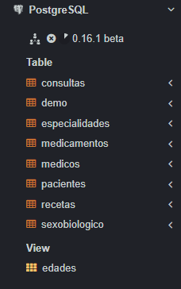

### 3. Actualizar la dirección de Luciana Gómez.

```sql
UPDATE Pacientes
SET calle = 'Calle Corrientes', numero = 500
WHERE nombre = 'Luciana Gómez';
```
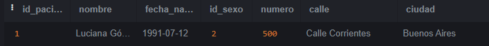


### 4. Seleccionar médicos cuya especialidad sea el id 4.

```sql
SELECT nombre, matricula
FROM Medicos
WHERE especialidad_id = 4;
```


### 5. Corregir inconsistencias en los nombres de las ciudades.

```sql
UPDATE Pacientes
SET ciudad = 'Buenos Aires'
WHERE LOWER(ciudad) LIKE '%buenos%' OR LOWER(ciudad) LIKE '%aires%';

UPDATE Pacientes
SET ciudad = 'Córdoba'
WHERE LOWER(ciudad) LIKE '%cordoba%' OR LOWER(ciudad) LIKE '%corodba%' OR LOWER(ciudad) LIKE '%córdoba%';

UPDATE Pacientes
SET ciudad = 'Mendoza'
WHERE LOWER(ciudad) LIKE '%mendoza%' OR LOWER(ciudad) LIKE '%mendzoa%';
```
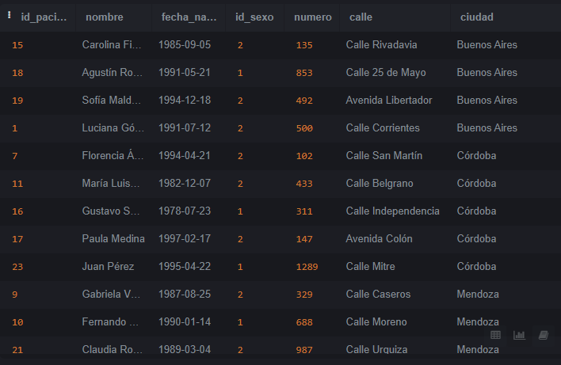


### 6. Obtener nombre y dirección de pacientes que viven en Buenos Aires.

```sql
SELECT nombre, calle, ciudad 
FROM pacientes 
WHERE ciudad = 'Buenos Aires';
```
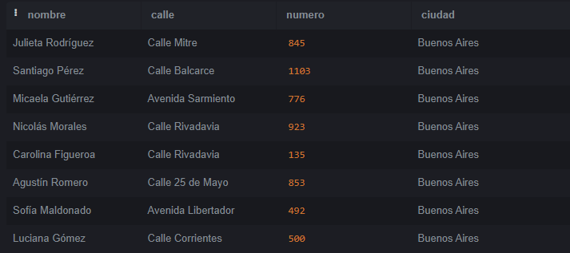

### 7. Cantidad de pacientes que viven en cada ciudad.

```sql
SELECT ciudad, COUNT(*) AS total_pacientes
FROM pacientes
GROUP BY ciudad;
```
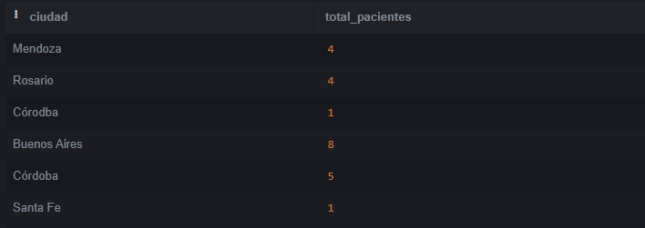

### 8. Cantidad de pacientes por sexo en cada ciudad.

```sql
SELECT 
    ciudad,
    COUNT(CASE WHEN p.id_sexo = 1 THEN 1 END) AS total_masculinos,
    COUNT(CASE WHEN p.id_sexo = 2 THEN 1 END) AS total_femeninos
FROM 
    pacientes p
GROUP BY 
    ciudad;
```
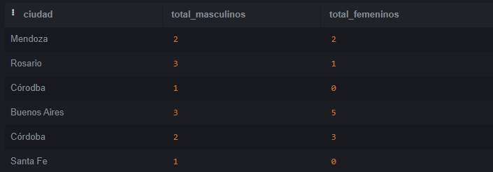

### 9. Obtener cantidad de recetas emitidas por cada médico.

```sql
SELECT m.nombre, COUNT(*) AS total_recetas
FROM recetas r
JOIN medicos m ON r.id_medico = m.id_medico
GROUP BY m.nombre, r.id_medico;
```
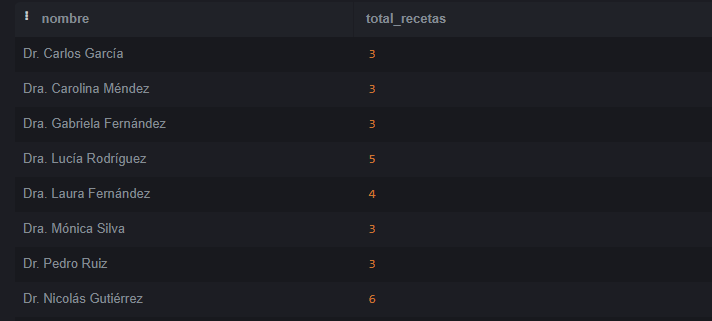

### 10. Consultas médicas del médico con ID 3 en agosto 2024.

```sql
SELECT *
FROM consultas
WHERE id_medico = 3 AND fecha >= '2024-08-01' AND fecha < '2024-09-01';
```
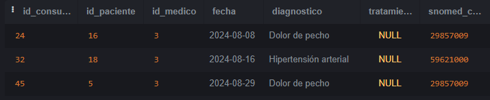

### 11. Obtener el nombre de los pacientes junto con la fecha y el diagnóstico de todas las consultas médicas realizadas en agosto del 2024.

```sql
SELECT p.nombre, c.fecha, c.diagnostico 
FROM consultas c
JOIN pacientes p ON c.id_paciente = p.id_paciente
WHERE fecha >= '2024-08-01' AND fecha < '2024-09-01';
```
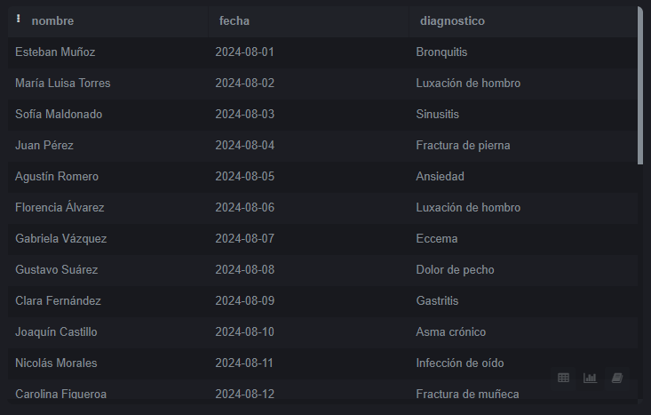
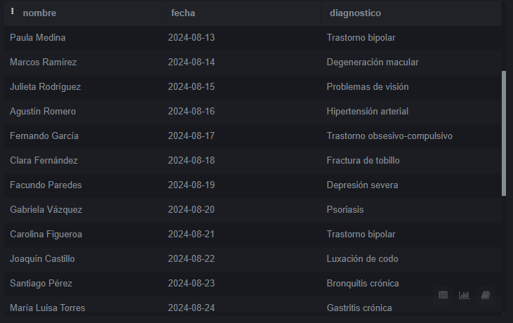
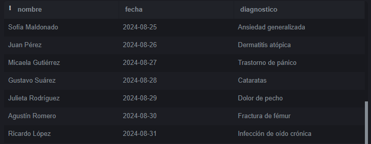


### 12. Obtener el nombre de los medicamentos prescritos más de una vez por el médico con ID igual a 2.
```sql 
SELECT med.nombre, COUNT(*) AS total_prescripciones 
FROM recetas r
JOIN medicamentos med ON r.id_medicamento = med.id_medicamento
WHERE r.id_medico = 2
GROUP BY med.nombre, r.id_medicamento
HAVING COUNT(*) > 1;
```


### 13. Obtener el nombre de los pacientes junto con la cantidad total de recetas que han recibido.
```sql 
SELECT p.nombre, COUNT(*) AS total_recetas 
FROM recetas r
JOIN pacientes p ON r.id_paciente = p.id_paciente
GROUP BY p.nombre; 
```
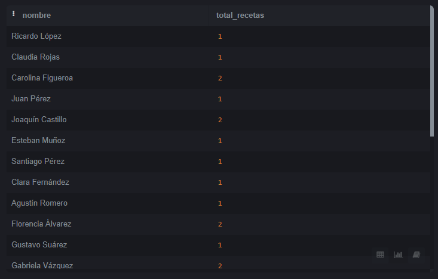
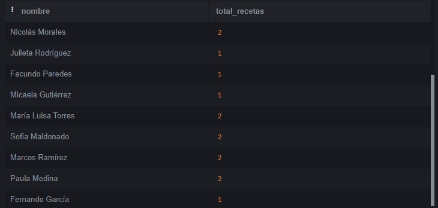


### 14. Obtener el nombre del medicamento más recetado junto con la cantidad de recetas emitidas para ese medicamento.

```sql 
SELECT med.nombre, COUNT(r.id_receta) AS total_recetas 
FROM recetas r
JOIN medicamentos med ON r.id_medicamento = med.id_medicamento
GROUP BY med.nombre
ORDER BY total_recetas DESC
LIMIT 1;
```


### 15. Obtener el nombre del paciente junto con la fecha de su última consulta y el diagnóstico asociado.
```sql 
SELECT p.nombre, c.fecha, c.diagnostico 
FROM consultas c
JOIN pacientes p ON c.id_paciente = p.id_paciente
WHERE c.fecha = (SELECT MAX(fecha) FROM consultas WHERE id_paciente = p.id_paciente);
```
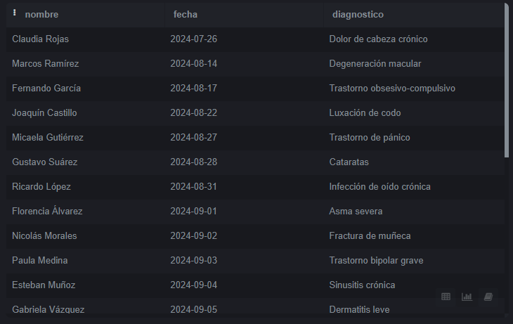
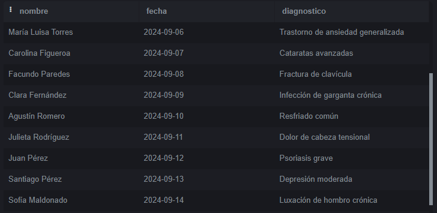

### 16. Obtener el nombre del médico junto con el nombre del paciente y el número total de consultas realizadas por cada médico para cada paciente, ordenado por médico y paciente.
```sql 
SELECT m.nombre AS medico, p.nombre AS paciente, COUNT(*) AS total_consultas 
FROM consultas c
JOIN medicos m ON c.id_medico = m.id_medico
JOIN pacientes p ON c.id_paciente = p.id_paciente
GROUP BY m.nombre, p.nombre  
ORDER BY m.nombre, p.nombre;
```
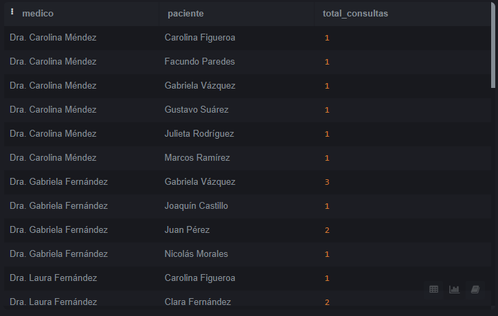
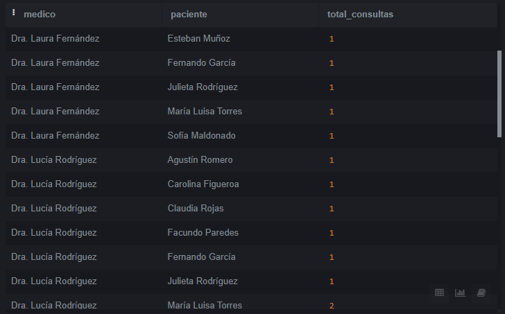

### 17. nombre del medicamento junto con el total de recetas prescritas para ese medicamento, el nombre del médico que lo recetó y el nombre del paciente al que se le recetó, ordenado por total de recetas en orden descendente.

```sql 
SELECT 
    med.nombre AS medicamento, 
    COUNT(r.id_receta) AS total_recetas,
    STRING_AGG(DISTINCT m.nombre, ', ') AS medicos,  
    STRING_AGG(DISTINCT p.nombre, ', ') AS pacientes 
FROM recetas r
JOIN medicamentos med ON r.id_medicamento = med.id_medicamento
JOIN medicos m ON r.id_medico = m.id_medico
JOIN pacientes p ON r.id_paciente = p.id_paciente
GROUP BY med.nombre 
ORDER BY total_recetas DESC;
```
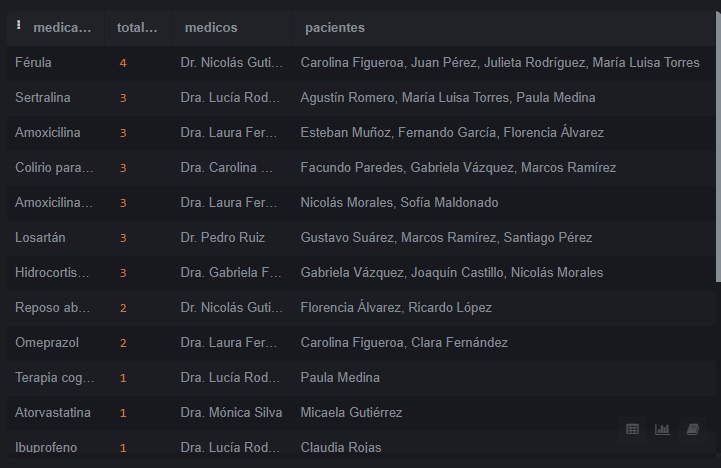

### 18. nombre del médico junto con el total de pacientes a los que ha atendido, ordenado por el total de pacientes en orden descendente.
```sql 
SELECT 
    m.nombre AS medico, 
    COUNT(DISTINCT c.id_paciente) AS total_pacientes 
FROM consultas c
JOIN medicos m ON c.id_medico = m.id_medico
GROUP BY m.nombre  
ORDER BY total_pacientes DESC;  

```
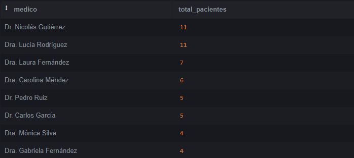
---

## PARTE III: Manejo de versiones con Git y Github

Link al repositorio GitHub: [https://github.com/VMedinaSantinon/InfoMed_TPV](https://github.com/VMedinaSantinon/InfoMed_TPV)

---

## PARTE IV: Reporting
Para llevar a cabo este análisis se desarrolló el tablero de control correspondiente a la base de datos descargada, post modificaciones, en Power BI

Link al Power BI: [https://app.powerbi.com/reportEmbed?reportId=93ee7b5c-6b00-418f-8da9-b528fcbb6ec4](https://app.powerbi.com/reportEmbed?reportId=93ee7b5c-6b00-418f-8da9-b528fcbb6ec4)

Link al google sheets: [https://docs.google.com/spreadsheets/d/1OcDA22X2NCPbYXZm81tjZfpfg0azLtpXBBDUGud4TVU/edit?usp=sharing](https://docs.google.com/spreadsheets/d/1OcDA22X2NCPbYXZm81tjZfpfg0azLtpXBBDUGud4TVU/edit?usp=sharing)

Análisis: 

En cuanto a la distribución de pacientes por ciudad, Buenos Aires es la ciudad con la mayor cantidad de pacientes atendidos, representando el 34.78% del total, es decir, 8 pacientes. Le siguen Córdoba con el 26.09% del total, es decir, 6 pacientes, y Rosario con el 17.39%, que representa 4 pacientes, al igual que Mendoza. La ciudad de Santa Fe presenta la menor cantidad de pacientes, con un 4.35%, lo que representa 1 único paciente. Este patrón sugiere que la mayoría de los pacientes provienen de grandes centros urbanos como Buenos Aires y Córdoba, lo cual podría estar vinculado a la mayor disponibilidad de servicios de salud en esas áreas.
Este indicador nos permite saber cuáles centros son los más demandados, y consecuentemente disponer las instalaciones para la capacidad prevista.
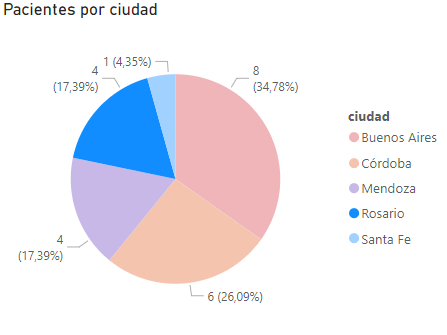


En relación a la cantidad de veces que se recetó cada medicamento, los fármacos más prescritos incluyen la Amoxicilina, Amoxicilina + Acido Clauvulanico, Colirio para glaucomas, Hidrocortisona, Losartán y Sertralina, con 3 prescripciones cada uno. Otros medicamentos como Omeprazol fueron recetados 2 veces. Por otro lado, medicamentos como Ibuprofeno, Paracetamol han sido recetados en una sola ocasión, lo que sugiere un menor uso de estos fármacos en este grupo de pacientes. Cabe aclarar que la mayor cantidad de receta fueron para Férulas por fracturas.
Tener control de los medicamentos recetados nos deja ver cuales son las necesidades atendidas normalmente, y por cuales razones los pacientes concurren a nuestros centros. Esto puede llegar a ser de utilidad tanto para visitadores médicos, como para darle prioridad a profesionales de ciertas áreas sobre las otras en cuanto a consultorios. Predisponiendo las instalaciones en función a las demandas observadas.
Por encima de esto, en caso de querer analizar más en profundidad cada diagnóstico y cada receta, el tablero cuenta con un listado ordenado alfabéticamente de dichos diagnósticos junto con sus respectivos pacientes, médicos y medicamentos recetados. Esto permite un estudio más detallado de cada tratamiento, en caso de que sea necesario.

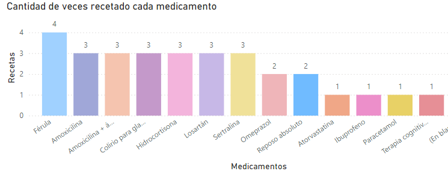


En lo que respecta a la carga de trabajo por médico según la cantidad de consultas, se observa una distribución desigual. La Dra. Lucía Rodríguez lidera con 14 consultas, lo que indica una carga de trabajo significativamente mayor en comparación con otros médicos. El Dr. Nicolás Gutiérrez sigue con 11 consultas, mientras que otros médicos como la Dra. Laura Fernández y la Dra. Gabriela Fernández atienden entre 8 y 7 consultas, respectivamente. 
Esto podría indicar que algunos médicos están sobrecargados, lo que puede impactar la calidad de atención o la eficiencia en los tiempos de consulta. En contraste, médicos como la Dra. Mónica Silva o el Dr. Pedro Ruiz han tenido solo 5 consultas, e incluso otros médicos no presentan consulta alguna, lo que indica una distribución altamente desigual del flujo de pacientes.
Este indicador nos permite medir la relación entre la cantidad de consultas en función a los medicos, relacionado con su especialidad, esto nos permite ver si la mayor cantidad de consultas se correlaciona con un solo medico en particular o si todos los medicos de esa especialidad se encuentran igual de demandados.
Esto nos da la oportunidad de mejorar la disponibilidad de los profesionales, de manera que se distribuya equitativamente la carga, y saber que especialidades se encuentran sin tener consultas.
También sirve para identificar oportunidades de mejora en la atención de algunos medicos, que no tienen consultas pero su especialidad si es demandada.
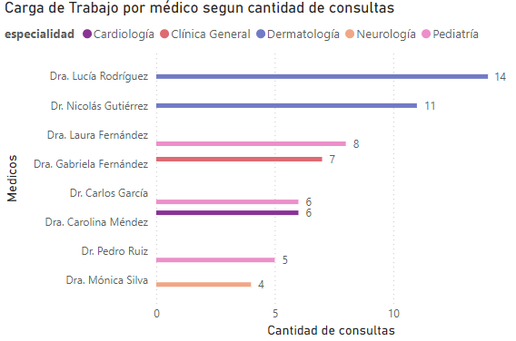


Respecto a la frecuencia de consultas por especialidad, Dermatología es la especialidad con mayor número de consultas, con 25 consultas, representando el 40.98%. Le sigue Pediatría con 19 consultas, que equivale al 31.15%. Las especialidades de Cardiología, Neurología y Clínica General tienen frecuencias menores, con 11.48%, 5.56% y 5.56%, respectivamente. Esto sugiere una mayor demanda de atención en el área de Dermatología, lo que podría estar relacionado con el aumento de consultas por afecciones dermatológicas o la disponibilidad de profesionales en esta área.
Este indicador, en conjunto con el de medicamentos, nos permite analizar el perfil de paciente que acude al centro médico disponer el mismo para atender las necesidades más demandadas, a su vez, nos permite dilucidar si el consumo de medicamentos está o no relacionado con las consultas más demandadas, en nuestro caso el medicamento/insumo más demandado es la Férula, pero el mayor número de consultas se registra en Dermatología, por lo que no necesariamente está relacionado, por lo que los visitadores médicos no necesariamente deben estar orientados a prestar servicio a los sectores con mayor número de consultas, ya que no son los que recetan más medicamentos
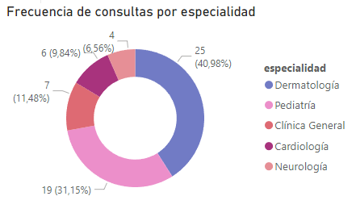


En cuanto a la distribución de pacientes por sexo, se observa que hay una distribución relativamente equilibrada entre pacientes de sexo femenino y masculino. Doce pacientes, que representan el 52.17%, son mujeres, mientras que once pacientes, que representan el 47.83%, son hombres. Esta paridad sugiere que no existen grandes diferencias en el género de los pacientes que acuden a consultas.
Este indicador nos resulta interesante para determinar si la baja demanda de consultas en especialistas en otros sectores, como puede ser ginecología y/o urología, tiene que ver con los pacientes que acuden a nuestro centro, o si puede estar relacionado con los profesionales o las necesidades que tienen.
Finalmente, en la tabla de recetas y diagnósticos asociados, se observan ejemplos de diagnósticos, junto con sus prescripciones y los datos de los pacientes y médicos de cada consulta. Esto nos sirve para complementar la tabla de medicamentos, y profesionales, otorgando un indicador global. 
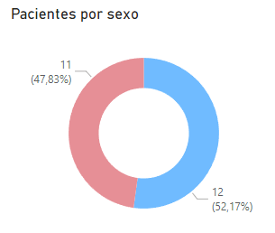